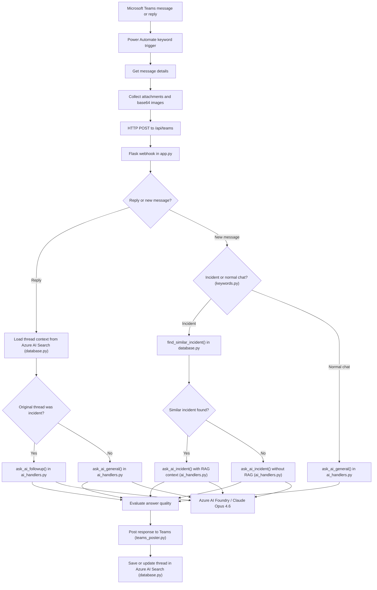
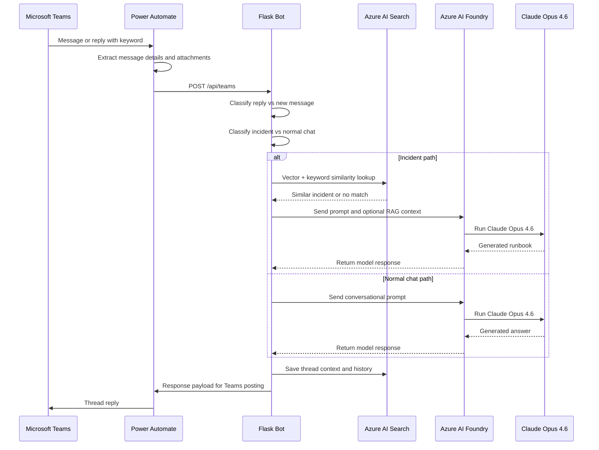

# 🤖 AKS SRE Bot — AI Incident Commander


An enterprise-grade **Automated Incident Response System** designed for Azure Kubernetes Service (AKS). 

This bot acts as a "Virtual SRE." It receives incident messages directly from **Power Automate** through an HTTP request, analyzes logs and screenshots using **Claude Opus 4.6**, looks up similar past incidents in **Azure AI Search**, and posts a strictly formatted, actionable Runbook directly to **Microsoft Teams**. The model layer can be hosted through **Azure AI Foundry** while Azure AI Search provides the retrieval layer for RAG.

> **Important:** the deployment-ready application lives in [Deploy](Deploy). Use [Deploy](Deploy) as the working folder for running the bot, tests, Docker packaging, and Azure deployment.

---

## 🚀 Key Features

* **🌐 HTTP Triggered:** Automatically activates when Power Automate sends a direct HTTP request to the bot.
* **🧠 AI Root Cause Analysis:** Uses **Claude Opus 4.6** to translate complex Kubernetes logs (e.g., CrashLoopBackOff, OOMKilled) into plain English.
* **🛡️ Azure AI Search RAG Memory:** Uses Azure AI Search vector search plus keyword overlap to identify similar incidents and reuse historical fixes.
* **☁️ Azure AI Foundry Ready:** The solution can use Azure AI Foundry as the hosted model access layer for Claude-based generation.
* **💬 Conversational Context:** Engineers can reply to the bot with follow-up questions. The bot recalls the specific error and previous chat history for that exact thread.
* **🌗 Smart Formatting:** Generates distinct, copy-pasteable `kubectl` commands with syntax highlighting (HTML/Markdown) for Teams.
* **🖼️ Screenshot-Aware Analysis:** Supports image attachments passed from Power Automate into the multimodal AI prompt.
* **📊 Response Evaluation:** Measures response quality per answer.
* **🌐 Live Tech Stack Grounding:** Auto-detects version/release questions about team tools (Argo, Istio, Prometheus, Flux, etc.) and fetches the real latest release from GitHub before calling Claude — overcoming the model's training cutoff.
* **🗂️ Modular Codebase:** Logic is split across focused modules (`keywords.py`, `database.py`, `ai_handlers.py`, `orchestrator.py`, etc.) for easy navigation and maintenance.

---


## 🏗️ Precise System Architecture

This diagram illustrates the updated end-to-end flow where **Power Automate sends a direct HTTP request** to the bot, **Azure AI Foundry hosts the generation model**, and **Azure AI Search** acts as the incident memory layer.



### Runtime sequence



---

## ⚡ Power Automate Workflow

This bot now relies on a **direct HTTP request** from Power Automate to the Python service.

### Inbound Teams → HTTP flow

* **Trigger:** `When keywords are mentioned`
* **Logic:**
  1. Initialize an array variable for attachments.
  2. Loop through each matching Teams message.
  3. Get the full message details.
  4. Loop through each attachment.
  5. Read file content using path.
  6. Append attachment data into the array variable.
  7. When attachments are fully collected, send a direct HTTP request to the bot.

### Suggested HTTP payload

Power Automate should send a JSON body shaped like this:

```json
{
  "message_id": "<teams-message-id>",
  "parent_id": "<thread-parent-id-or-null>",
  "subject": "AKS incident",
  "body": "Pod is in CrashLoopBackOff and kubectl logs show fatal error",
  "base64_images": [
    "data:image/png;base64,<payload>"
  ]
}
```

### What the bot does with the HTTP payload

1. Reads `message_id` and `parent_id` to detect whether the event is a new message or a reply.
2. Uses `body` and `subject` to determine whether the request is an incident or normal support chat.
3. Passes `base64_images` into the multimodal AI prompt if attachments were included.
4. Stores the resulting diagnosis and chat history by thread id in Azure AI Search.

### HTTP payload destination

Power Automate sends the request directly to the Python webhook endpoint handled by [Deploy/app.py](Deploy/app.py):

- `POST /api/teams`

This removes the old Outlook/email relay entirely and gives a simpler, faster path from Teams into the bot.

> **💡 Best Practice:** Keep the keyword trigger scoped to a specific term such as `DLL-WORKFLOWS` so the bot only processes intended support messages.

---

## 🔎 Azure AI Search RAG Logic

The bot uses **Azure AI Search** as its retrieval and memory layer.

### What is stored

Each incident is stored with:
- thread id
- subject
- raw log or message body
- diagnosis/runbook
- chat history
- embedding vector in `contentVector`

### How matching works

When a new incident arrives:

1. The bot extracts high-signal keywords from the log.
2. It creates an embedding from the extracted keywords using the embedding model.
3. It runs a vector similarity search in Azure AI Search.
4. It also computes keyword overlap between the incoming incident and candidate stored incidents.
5. It accepts a match only if both conditions are strong enough:
  - vector similarity passes the threshold
  - keyword overlap passes the threshold

This reduces false positives from noisy Kubernetes logs and avoids reusing unrelated fixes.

### Why Azure AI Search is used here

- fast vector search for similar incidents
- easy storage of thread-based records
- good fit for hybrid retrieval using vectors plus metadata fields
- scalable memory layer for incident history

---

## ☁️ Azure AI Foundry Model Layer

The generation layer is designed around **Claude Opus 4.6**.

### Model used

- **Primary generation model:** Claude Opus 4.6

### How it fits into the solution

- Power Automate sends the incident payload to the bot.
- The bot retrieves possible context from Azure AI Search.
- The bot sends either:
  - a runbook-generation prompt, or
  - a conversational follow-up prompt
  to the model layer.
- Claude Opus 4.6 generates the final answer.

### Why this combination works

- **Azure AI Search** handles retrieval and historical memory.
- **Azure AI Foundry** provides the hosted AI platform layer.
- **Claude Opus 4.6** handles deep reasoning and high-quality runbook generation.

---
## ⚙️ Code Logic & Inner Workings

For developers and team members reviewing the codebase, here is a breakdown of what each major module does and why it exists.

### Where to look when something breaks

| Problem | File to open |
|---|---|
| Wrong AI answer or format | `ai_handlers.py` |
| Bot posts to wrong Teams thread | `teams_poster.py` |
| Search doesn't find or saves wrong docs | `database.py` |
| Wrong version info for a tool | `github_grounding.py` |
| Incident not detected or misclassified | `keywords.py` |
| Reply vs new message routing wrong | `orchestrator.py` |
| Webhook or API endpoint issues | `app.py` |
| Azure clients, keys, embedding model | `azure_config.py` |
| Teams webhook URL or shared HTTP session | `config.py` |

---

### 1. HTTP Ingestion — `app.py`
* **`teams_webhook()`**
  * **Why:** Acts as the main entry point for Teams-triggered requests.
  * **How:** Receives the JSON payload from Power Automate, extracts message metadata and attachments, determines whether the request is a new message or a reply, and hands processing to `orchestrator.py`.

* **`process_teams_message()` — `orchestrator.py`**
  * **Why:** Central orchestration function for all incoming requests.
  * **How:** Chooses the correct branch for:
    - new incident
    - new normal chat
    - incident follow-up
    - general follow-up

### 2. Memory & Context — `database.py`
* **`get_thread_context(thread_id)`**
  * **Why:** Allows the bot to maintain conversational memory for follow-up questions.
  * **How:** Fetches the thread document from Azure AI Search using the thread id as the document key.
* **`save_or_update_incident(thread_id, subject, log, diagnosis, chat_history)`**
  * **Why:** Saves the state of an incident so it can be recalled later or searched.
  * **How:** Extracts keywords, creates an embedding, and uploads a document to Azure AI Search with the thread id as the key.
* **`find_similar_incident(log_text)`**
  * **Why:** Prevents the AI from analyzing the exact same error twice.
  * **How:** Performs vector search against Azure AI Search and combines that with Jaccard keyword overlap to determine whether a historical incident is safe to reuse.

### 3. Keyword Extraction & Classification — `keywords.py`
* **`extract_keywords(text)`**
  * **Why:** Improves matching quality for noisy AKS logs.
  * **How:** Keeps cluster-specific terms and filters common infrastructure noise before generating the embedding.
* **`is_incident_message(text)`**
  * **Why:** Decides whether to run the runbook path or the general chat path.
  * **How:** Scores the message against incident patterns, log patterns, and cluster vocabulary.
* **`is_history_request(text)`**
  * **Why:** Detects when the user asks about previous incidents.
  * **How:** Matches question phrasing against history-intent patterns.

### 4. AI Processing — `ai_handlers.py`
* **`ask_ai_incident(user_log)`**
  * **Why:** Generates the initial, highly-formatted Runbook.
  * **How:** Uses a strict prompt to produce a runbook-style answer with root cause, resolution steps, and verification commands. If a similar incident is found, it also injects that historical context before sending to **Claude Opus 4.6**.
* **`ask_ai_followup(user_question, log_context, chat_history_list)`**
  * **Why:** Handles conversational Q&A inside an incident thread.
  * **How:** Injects the original log and past conversation into the prompt context.
* **`ask_ai_general(user_message, ...)`**
  * **Why:** Handles normal support questions that are not incidents.
  * **How:** Uses a lighter conversational system prompt and injects live GitHub release data when the question is about a known team tool.
* **`ask_ai_history_summary(query_text, matches)`**
  * **Why:** Summarises patterns across multiple matched past incidents.
  * **How:** Builds a structured context block from matched records and asks Claude to identify themes and recommend next steps.

### 5. Live Tech Stack Grounding — `github_grounding.py`
* **`_build_release_context(user_message)`**
  * **Why:** Overcomes Claude's training-data cutoff for version/release questions.
  * **How:** Detects version-related keywords and a known tool name, fetches the real latest release from the GitHub API, and injects the result into Claude's system prompt as authoritative data.
* **`fetch_github_latest_release(repo_slug)`**
  * **Why:** Gets live release data directly from GitHub.
  * **How:** Calls the public `releases/latest` API with a 1-hour in-process TTL cache to respect rate limits.

### 6. Teams Delivery — `teams_poster.py`
* **`post_incident_card(...)` & `post_chat_card(...)`**
  * **Why:** Bridges Python and Microsoft Teams.
  * **How:** Takes the HTML or Markdown generated by the AI, wraps it in a JSON payload, and sends an HTTP POST to the Power Automate Webhook URL.

### 7. Utilities — `utils.py`
* HTML stripping and escaping for Teams markup cleanup.
* Base64 image conversion to Claude vision content blocks.
* Chat history parsing and appending helpers.

### 8. Response Evaluation — `response_metrics.py`
* **`evaluate_response(...)` and `evaluate_followup(...)`**
  * **Why:** Provide quality scoring for generated answers.
  * **How:** Score structure, actionability, relevance, conciseness, code blocks, verification coverage, and latency.

---

## 🔄 Detailed Decision Flow

### New message path

1. Power Automate sends `POST /api/teams`.
2. The bot checks whether the message is a reply.
3. If it is not a reply, the bot classifies the message as:
   - incident
   - normal chat
4. If incident:
   - search Azure AI Search for similar incidents
   - run AI with or without retrieved context
   - evaluate answer
   - post to Teams
   - save thread state
5. If normal chat:
   - generate conversational answer
   - evaluate answer
   - post to Teams
   - save thread state

### Reply path

1. Bot loads the parent thread from Azure AI Search.
2. If the original thread was incident-related, use follow-up incident mode.
3. Otherwise, use general conversational follow-up mode.
4. Post the answer and update the stored chat history.

---

## 📋 Prerequisites

### 1. Environment
* **OS:** Windows recommended for local development in this repo.
* **Python:** 3.10+

### 2. Infrastructure
* **Azure AI Search:** Required for incident memory and RAG retrieval.
* **Azure AI Foundry:** Recommended as the hosted platform layer for model access.
* **Claude Opus 4.6:** Used for incident analysis, follow-up answers, and normal chat.
* **Embedding model access:** Required for vector generation used by Azure AI Search.
* **Microsoft Teams + Power Automate:** A configured flow that collects Teams message details and sends them directly to the bot over HTTP.

---

## 📦 Installation

**1. Clone and Setup Environment:**
```bash
git clone [https://your-repo-url.git](https://your-repo-url.git)
cd AKS-SRE-Bot
cd Deploy
python -m venv .venv
.\.venv\Scripts\activate
```

**2. Install Dependencies:**

```bash
pip install -r requirements.txt
```

**3. Configure Environment Variables:**
Create an `Azure.env` file in the root directory:

```ini
# Embedding and model configuration
AZURE_OPENAI_ENDPOINT="[https://your-resource.openai.azure.com/](https://your-resource.openai.azure.com/)"
AZURE_OPENAI_KEY="<YOUR_KEY>"
AZURE_OPENAI_API_VERSION="2024-12-01-preview"
CLAUDE_MODEL="claude-opus-4-6"
EMBED_MODEL="<YOUR_EMBEDDING_MODEL>"

# Claude / Foundry access
ANTHROPIC_ENDPOINT="<YOUR_ANTHROPIC_OR_FOUNDRY_ENDPOINT>"
ANTHROPIC_API_KEY="<YOUR_API_KEY>"

# Teams Delivery
TEAMS_WEBHOOK_URL="<YOUR_TEAMS_WEBHOOK_URL>"
```

## 🚀 Usage

### Starting the Bot
Run the main script. Keep this terminal open.

```bash
python app.py
```
Expected Output: the Flask bot starts and listens for HTTP requests on the configured port.

### Asking a Follow-up Question (Scenario A)
To reply to an existing incident, trigger the Power Automate flow again from the same Teams thread so it sends another HTTP request with the thread context.

Example message content:

```text
How do I increase the memory limit for this deployment?
```

## 📁 Project Structure

```
aks-sre-bot/
│
├── Deploy/
│   ├── app.py                  # 🌐 Flask entry point — webhook routes only
│   ├── orchestrator.py         # 🚀 Message routing and flow control
│   ├── ai_handlers.py          # 🧠 All Claude AI call functions
│   ├── database.py             # 💾 Azure AI Search: get / save / find / search
│   ├── keywords.py             # 🔑 Keyword extraction and message classifiers
│   ├── github_grounding.py     # 🌐 Live GitHub release fetcher (tech stack grounding)
│   ├── teams_poster.py         # 📤 Teams card posting functions
│   ├── utils.py                # 🛠️ HTML helpers, image blocks, chat history utils
│   ├── config.py               # ⚙️ Shared config: webhook URL and HTTP session
│   ├── azure_config.py         # ☁️ Azure OpenAI and Search client setup
│   ├── response_metrics.py     # 📊 Response quality evaluation
│   ├── requirements.txt        # 📦 Python dependencies
│   ├── Azure.env               # 🔑 Runtime secrets and configuration
│   ├── Dockerfile              # 🐳 Container build definition
│   ├── startup.sh              # ▶️ Container startup script
│   └── tests/                  # 🧪 Test scripts and HTML report generator
│
└── README.md                   # 📄 High-level project documentation
```